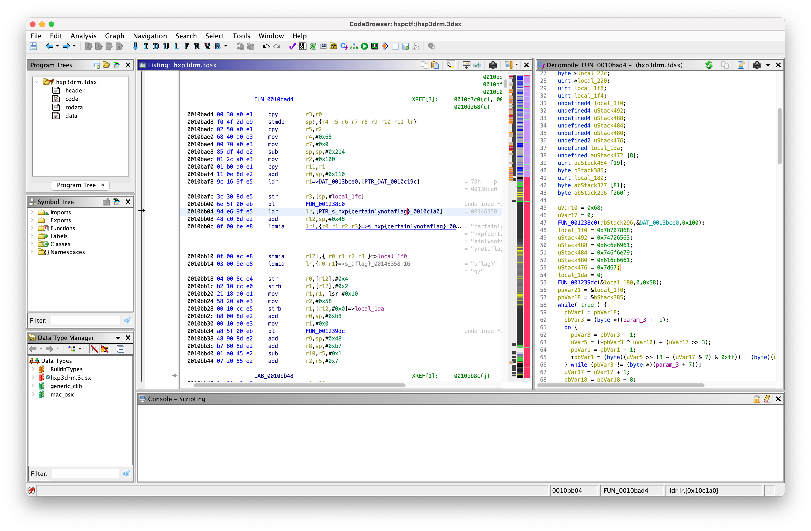

# Nintendo 3DS Homebrew Application (3DSX) file loader for Ghidra

This is a quick and dirty port of [`3DSX-IDA-PRO-Loader`](https://github.com/0xEBFE/3DSX-IDA-PRO-Loader) for Ghidra.

Wrote this for [`hxp3drm`](https://2021.ctf.link/internal/challenge/12cd5c22-9219-4659-acc2-3050714bbdc3) challange at [`hxpCTF-2021`](https://2021.ctf.link).

3dsx file format description can be found [here](https://www.3dbrew.org/wiki/3DSX_Format).

